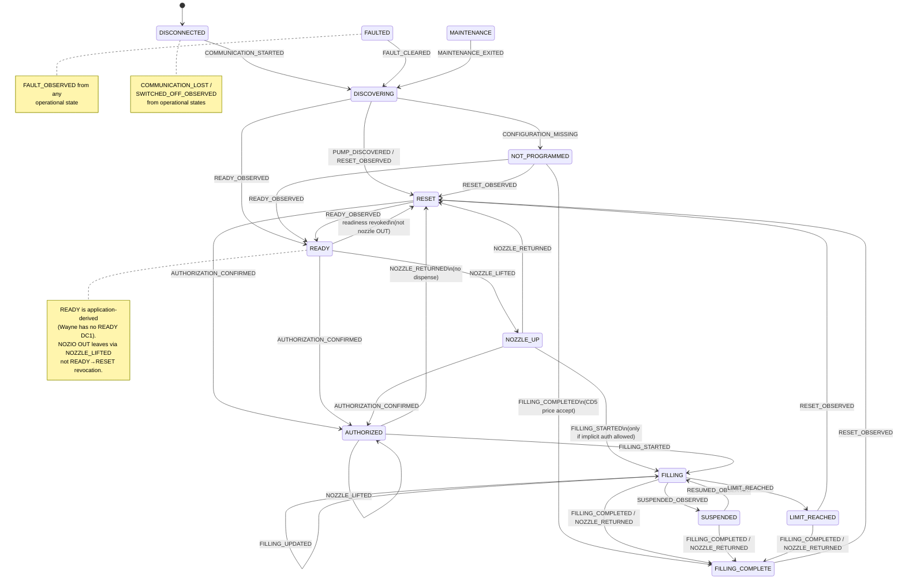

# InteliPump Normalized Pump State Machine

Phase 4 defines a pure, deterministic pump state machine. It consumes
normalized events (often produced from Wayne application observations) and
never transmits DART frames or executes commands.

## States

```text
DISCONNECTED
DISCOVERING
NOT_PROGRAMMED
RESET
READY
NOZZLE_UP
AUTHORIZED
FILLING
FILLING_COMPLETE
SUSPENDED
LIMIT_REACHED
FAULTED
MAINTENANCE
```

Wayne protocol-specific statuses remain in
`protocol.dart.application.status.WaynePumpStatus` and are mapped cautiously.

## State diagram



## Wayne DC1 vs normalized status

Source: Pump Interface Rev 2.11 page 20. There is **no status 3**.

| Wayne DC1 | Code | Normalized mapping |
|---|---|---|
| PUMP NOT PROGRAMMED | 0 | `CONFIGURATION_MISSING` → `NOT_PROGRAMMED` |
| RESET | 1 | `RESET_OBSERVED` → `RESET` (READY may be derived separately) |
| AUTHORIZED | 2 | `AUTHORIZATION_CONFIRMED` → `AUTHORIZED` |
| *(none)* | 3 | Not defined in Rev 2.11 |
| FILLING | 4 | `FILLING_STARTED` / `FILLING_UPDATED` → `FILLING` |
| FILLING COMPLETED | 5 | `FILLING_COMPLETED` → `FILLING_COMPLETE` |
| MAX AMOUNT/VOLUME | 6 | `LIMIT_REACHED` → `LIMIT_REACHED` |
| SWITCHED OFF | 7 | `SWITCHED_OFF_OBSERVED` → `DISCONNECTED` |
| SUSPENDED | 8 | `SUSPENDED_OBSERVED` → `SUSPENDED` |

`READY` and `NOZZLE_UP` are **normalized-only** — never Wayne DC1 codes.

## Transition table (minimum)

| From | Event | To |
|---|---|---|
| DISCONNECTED | COMMUNICATION_STARTED | DISCOVERING |
| DISCOVERING | PUMP_DISCOVERED | RESET |
| DISCOVERING | CONFIGURATION_MISSING | NOT_PROGRAMMED |
| DISCOVERING | RESET_OBSERVED | RESET |
| DISCOVERING | READY_OBSERVED | READY |
| RESET | READY_OBSERVED | READY |
| READY | NOZZLE_LIFTED | NOZZLE_UP |
| READY | AUTHORIZATION_CONFIRMED | AUTHORIZED |
| READY | RESET_OBSERVED | READY (noop; READY overlays Wayne RESET) |
| RESET | AUTHORIZATION_CONFIRMED | AUTHORIZED |
| NOZZLE_UP | AUTHORIZATION_CONFIRMED | AUTHORIZED |
| NOZZLE_UP | NOZZLE_RETURNED | RESET |
| AUTHORIZED | FILLING_STARTED | FILLING |
| AUTHORIZED | NOZZLE_LIFTED | AUTHORIZED (noop; then expect FILLING) |
| AUTHORIZED | NOZZLE_RETURNED | RESET (cancel; no dispense) |
| NOZZLE_UP | FILLING_STARTED | FILLING (guarded) |
| FILLING | FILLING_UPDATED | FILLING |
| FILLING | FILLING_COMPLETED | FILLING_COMPLETE |
| FILLING | NOZZLE_RETURNED | FILLING_COMPLETE |
| FILLING | SUSPENDED_OBSERVED | SUSPENDED |
| SUSPENDED | RESUMED_OBSERVED | FILLING |
| FILLING | LIMIT_REACHED | LIMIT_REACHED |
| FILLING_COMPLETE | RESET_OBSERVED | RESET |
| operational | FAULT_OBSERVED | FAULTED |
| FAULTED | FAULT_CLEARED | DISCOVERING |
| any | COMMUNICATION_LOST | DISCONNECTED |
| any (except MAINTENANCE) | MAINTENANCE_ENTERED | MAINTENANCE |
| MAINTENANCE | MAINTENANCE_EXITED | DISCOVERING |

Undocumented transitions are rejected with a typed `TransitionResult`
(`accepted=false`, reason, severity, observation reference). Normal invalid
operational transitions do not raise exceptions.

## NOZIO / DC3 edge examples

NOZIO bit7..4 = OUT flag (`0x10`), bit3..0 = logical nozzle. Documented
examples (price BCD `00 11 75` = 11.75 with 2 decimals):

| Situation | NOZIO | Before (context) | Mapped event | After |
|---|---|---|---|---|
| First IN, READY edge | `0x01` | `nozzle_out=False`, DC1=RESET, healthy | `READY_OBSERVED` | `READY` |
| Lift nozzle 1 | `0x11` | `READY`, `nozzle_out=False` | `NOZZLE_LIFTED` | `NOZZLE_UP` |
| Repeat OUT | `0x11` | `NOZZLE_UP`, `nozzle_out=True` | `NOZZLE_STATUS_OBSERVED` | unchanged |
| Select nozzle 2 while OUT | `0x12` | OUT, selected=1 | `NOZZLE_SELECTION_CHANGED` | selected=2 |
| Return before authorize | `0x02` | `NOZZLE_UP`, OUT | `NOZZLE_RETURNED` | `RESET` (READY only via predicate edge) |
| Hang-up during FILLING | `0x01` | `FILLING`, OUT | `NOZZLE_RETURNED` | `FILLING_COMPLETE` (await DC1=5) |

Ambiguous CD3/DC3 (no proven slave→master direction) must **not** update
nozzle/price context.

## Invalid-transition policy

- Return `TransitionResult` with `accepted=False`.
- Preserve current state.
- Append a warning; do not invent compensating events.
- Severity is typically `ERROR` for illegal pairs, `WARNING` for stale or
  policy-rejected paths (for example implicit authorize).

## Duplicate / stale-event policy

- Repeated same-state observations (for example READY while READY) are
  accepted as no-ops.
- `state_version` increments only on meaningful context or state changes.
- Completion evidence keys prevent a second completion for the same source
  evidence (`source_completion_key` / frame|tid|ttype identity — no schema
  migration required).
- Stale timestamps (`observed_at` older than `last_observation_at`) do not
  roll state backward.
- Identical observation identities are treated as duplicates.
- Timestamps are never inferred when absent.

## Restart reconciliation policy

See `state_machine/reconciliation.py`:

- Prefer live dispenser evidence over persisted state.
- Never automatically authorize.
- Never replay pending non-idempotent commands.
- Preserve unresolved transaction identifiers for investigation.
- Live FILLING / FILLING_COMPLETE recover into those states with warnings.
- Unknown live state → DISCOVERING; no communication → DISCONNECTED.

## Active-command safety

Command eligibility is evaluated in `state_machine/guards.py` only.
Guards never transmit, queue, or execute commands. See
`docs/safety/command-eligibility.md`.

## Unresolved Wayne mapping ambiguities

1. **CD1 vs DC1** (TRANS `0x01` LNG=1): without direction or outstanding
   request context → `UNKNOWN_OBSERVATION` (no state force).
2. **CD3 vs DC3** (TRANS `0x03` LNG=4): passive decode is
   `AMBIGUOUS_CD3_OR_DC3` with `PARTIAL` status and `UNKNOWN` direction.
   Lifecycle mapping requires `resolve_as_dc3=True` or proven
   slave→master session context — never TRANS alone. Ambiguous traffic
   must not update nozzle or price verification.
3. **Wayne has no READY status**: `READY_OBSERVED` is derived only when
   `can_derive_ready()` is true (DC1=`RESET`, nozzle IN, healthy comms,
   no unresolved txn, no fault) and only on the false→true readiness edge.
   Central helper: `state_machine/readiness.py`.
4. **Nozzle events are edge-triggered**: repeated DC3 OUT/IN does not
   re-emit lift/return; selection changes while OUT emit
   `NOZZLE_SELECTION_CHANGED`.
5. **SWITCHED_OFF**: maps to `SWITCHED_OFF_OBSERVED` (disconnect path),
   never READY/RESET.
6. **Implicit authorization**: `NOZZLE_UP + FILLING_STARTED` requires
   `allow_implicit_authorize_to_filling=True`; otherwise rejected with warning.
7. **AUTHORIZE timing (protocol-complete default)**: Wayne allows AUTHORIZE
   before or after nozzle lift (normally from RESET). Normalized eligibility
   allows `{RESET, READY, NOZZLE_UP}`. Optional InteliPump policy flag
   `require_nozzle_lift_before_authorize` may restrict to lift-first; that is
   deployment policy, not a Wayne protocol rule.
8. **Nozzle hang-up**: DC3 OUT→IN during `{FILLING, SUSPENDED,
   LIMIT_REACHED}` emits `NOZZLE_RETURNED` → normalized `FILLING_COMPLETE`
   with `awaiting_filling_complete` until DC1 STATUS=5 confirms (or
   inferred completion with audit). Completion remains idempotent via
   evidence keys.
9. **DC1 STATUS codes (Rev 2.11 page 20)**: 0,1,2,4,5,6,7,8 — there is no
   status 3. FILLING=4, FILLING_COMPLETED=5, MAX=6. Do not use alternate
   §9 numberings that shift these codes.
10. **FILLING_UPDATED vs FILLING_STARTED**: emit `FILLING_UPDATED` only when
    normalized `current_state` is already `FILLING`. Do not key off a
    pre-set Wayne status alone (simulator may encode intended DC1 before
    the mapped transition).
