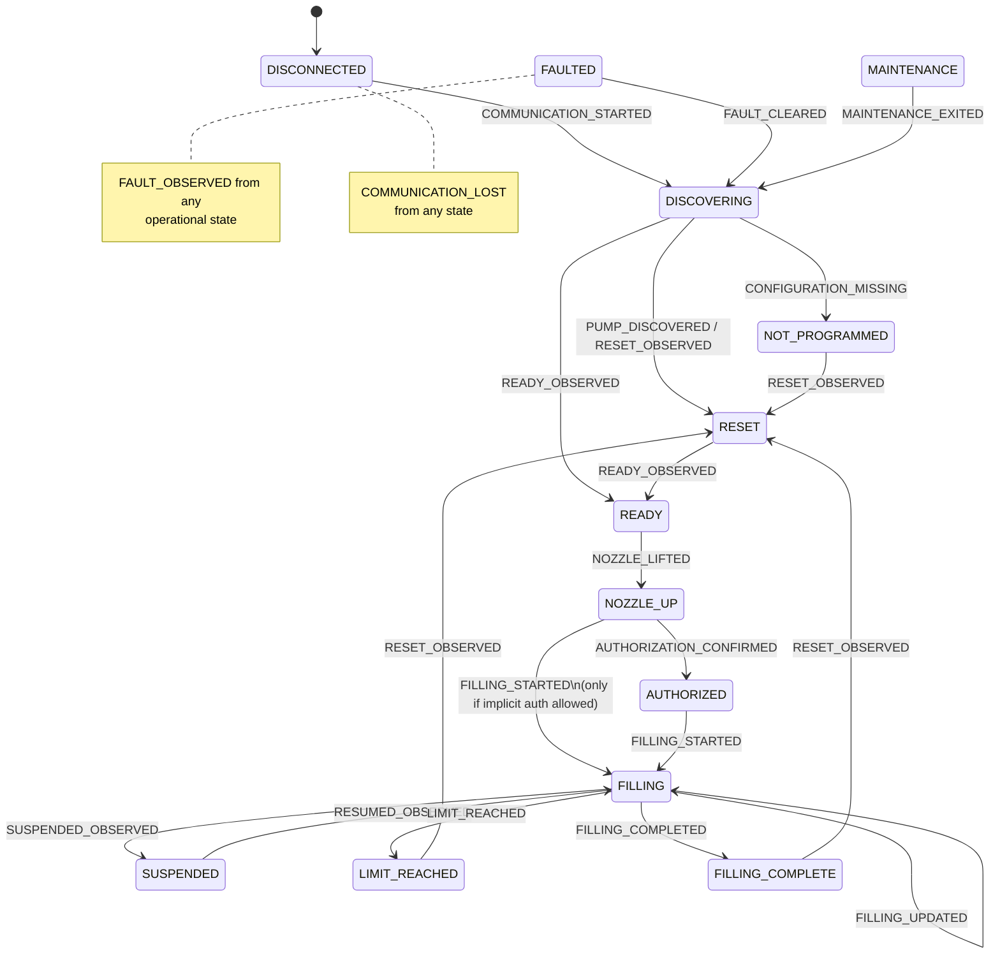

# InteliPump Normalized Pump State Machine

Phase 4 defines a pure, deterministic pump state machine. It consumes
normalized events (often produced from Wayne application observations) and
never transmits DART frames or executes commands.

## States

```text
DISCONNECTED
DISCOVERING
NOT_PROGRAMMED
RESET
READY
NOZZLE_UP
AUTHORIZED
FILLING
FILLING_COMPLETE
SUSPENDED
LIMIT_REACHED
FAULTED
MAINTENANCE
```

Wayne protocol-specific statuses remain in
`protocol.dart.application.status.WaynePumpStatus` and are mapped cautiously.

## State diagram



## Transition table (minimum)

| From | Event | To |
|---|---|---|
| DISCONNECTED | COMMUNICATION_STARTED | DISCOVERING |
| DISCOVERING | PUMP_DISCOVERED | RESET |
| DISCOVERING | CONFIGURATION_MISSING | NOT_PROGRAMMED |
| DISCOVERING | RESET_OBSERVED | RESET |
| DISCOVERING | READY_OBSERVED | READY |
| RESET | READY_OBSERVED | READY |
| READY | NOZZLE_LIFTED | NOZZLE_UP |
| NOZZLE_UP | AUTHORIZATION_CONFIRMED | AUTHORIZED |
| AUTHORIZED | FILLING_STARTED | FILLING |
| NOZZLE_UP | FILLING_STARTED | FILLING (guarded) |
| FILLING | FILLING_UPDATED | FILLING |
| FILLING | FILLING_COMPLETED | FILLING_COMPLETE |
| FILLING | SUSPENDED_OBSERVED | SUSPENDED |
| SUSPENDED | RESUMED_OBSERVED | FILLING |
| FILLING | LIMIT_REACHED | LIMIT_REACHED |
| FILLING_COMPLETE | RESET_OBSERVED | RESET |
| operational | FAULT_OBSERVED | FAULTED |
| FAULTED | FAULT_CLEARED | DISCOVERING |
| any | COMMUNICATION_LOST | DISCONNECTED |
| any (except MAINTENANCE) | MAINTENANCE_ENTERED | MAINTENANCE |
| MAINTENANCE | MAINTENANCE_EXITED | DISCOVERING |

Undocumented transitions are rejected with a typed `TransitionResult`
(`accepted=false`, reason, severity, observation reference). Normal invalid
operational transitions do not raise exceptions.

## Invalid-transition policy

- Return `TransitionResult` with `accepted=False`.
- Preserve current state.
- Append a warning; do not invent compensating events.
- Severity is typically `ERROR` for illegal pairs, `WARNING` for stale or
  policy-rejected paths (for example implicit authorize).

## Duplicate / stale-event policy

- Repeated same-state observations (for example READY while READY) are
  accepted as no-ops.
- `state_version` increments only on meaningful context or state changes.
- Completion evidence keys prevent a second completion for the same source
  evidence.
- Stale timestamps (`observed_at` older than `last_observation_at`) do not
  roll state backward.
- Identical `source_frame_raw_hex` references are treated as duplicates.
- Timestamps are never inferred when absent.

## Restart reconciliation policy

See `state_machine/reconciliation.py`:

- Prefer live dispenser evidence over persisted state.
- Never automatically authorize.
- Never replay pending non-idempotent commands.
- Preserve unresolved transaction identifiers for investigation.
- Live FILLING / FILLING_COMPLETE recover into those states with warnings.
- Unknown live state → DISCOVERING; no communication → DISCONNECTED.

## Active-command safety

Command eligibility is evaluated in `state_machine/guards.py` only.
Guards never transmit, queue, or execute commands. See
`docs/safety/command-eligibility.md`.

## Unresolved Wayne mapping ambiguities

1. **CD1 vs DC1** (TRANS `0x01` LNG=1): without direction or outstanding
   request context → `UNKNOWN_OBSERVATION` (no state force).
2. **CD3 vs DC3** (TRANS `0x03` LNG=4): Phase-3 prefer-DC3 is `PARTIAL` and
   insufficient → `UNKNOWN_OBSERVATION` until `resolve_as_dc3=True`.
3. **Wayne has no READY status**: `READY_OBSERVED` is inferred from resolved
   DC3 `nozzle_out=false` when not in a nozzle/fueling operational state.
4. **SWITCHED_OFF**: no dedicated normalized event; preserved as
   `UNKNOWN_OBSERVATION`.
5. **Implicit authorization**: `NOZZLE_UP + FILLING_STARTED` requires
   `allow_implicit_authorize_to_filling=True`; otherwise rejected with warning.
